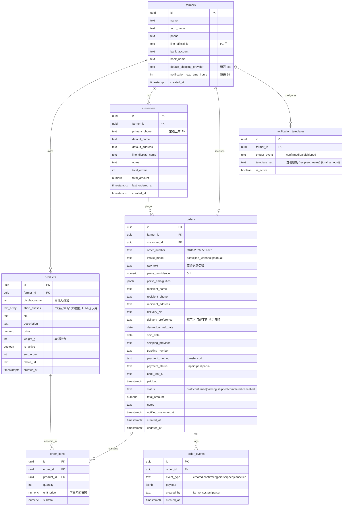

# PRD｜農友出貨流程數位化系統

> **代號**：FarmFlow（暫定）
> **版本**：v0.1（MVP 規劃稿，2026-05）
> **狀態**：P0 開發前夕，技術決策已凍結
> **依據**：260423 整合分析報告、四位種子農友訪談、技術 QA 決策紀錄

---

## 目錄
1. 產品願景與核心定位
2. 目標用戶
3. 第一性原理：訂單流程的九環節拆解
4. 七層產品架構（L0–L6）
5. Phase 規劃（P0–P4）
6. 核心資料模型（Schema + ER Diagram）
7. LLM Parser 設計
8. 非功能性需求
9. P0 Definition of Done

---

## 1. 產品願景與核心定位

### 1.1 一句話定位
> **農民出貨流程的最後一哩路解決方案。**

不是「農業 AI 平台」，不是「農產電商」，是把農友每晚 30–60 分鐘的「LINE 訊息 → Excel → 黑貓出貨單」這條手工產線，壓縮成 5 分鐘可完成的數位流程。

### 1.2 核心信念（產品哲學）

**(1) 農友是生產工廠，不是訂單管理員。**
系統的最高目的是讓農友把時間還給「田裡」，而不是培養他們成為「資訊工作者」。任何要求農友主動建檔、輸入、整理資料的功能，預設都是錯的。

**(2) 隱式 CRM。**
客戶資料不是農友手動輸入的對象，而是他做出貨、對帳時系統自然累積的副產品。CRM 是基底層（L0）而非入口。

**(3) LINE 優先，但不依賴 LINE。**
農友的訂單實質來源是 LINE，但系統的訂單接收層（L1）必須做成可插拔（pluggable）：今天用「貼上」，明天接 LINE Messaging API，後天接 FB DM，下游處理流程零修改。

**(4) 介面要快，不要美。**
PWA 行動優先，操作步數壓到極限。農友在田裡用單手滑手機就要能完成核心流程。

---

## 2. 目標用戶

### 2.1 種子農友（MVP 對象）

| 農友 | 規模 | 通路 | 系統化程度 | 主要痛點 | MVP 角色 |
|------|------|------|------------|----------|----------|
| **官庭安** | 小 | 全直銷（LINE） | 低（手寫平板＋黑貓單筆） | 黑貓單筆建立太慢、手機操作場景多 | **P0 首位測試者** |
| **陳惠茹** | 小 | 全直銷 | 中（紙本＋簡單表格） | 訂單接收完全手動 | **P0 第二測試者** |
| **徐方** | 中 | 全直銷（搶購制） | 高（GAS + 表單） | 已有自製系統，痛點在「對帳工具的成熟度」 | **P1 對帳/通知測試者** |
| **陳奕宏** | 中 | 全直銷 + 通路 | 高（堂哥做的網頁，月費 1,000） | 客人仍會私訊 LINE 繞過系統 | **P1 LINE Webhook 測試者** |

> **設計含義**：P0 必須對「最不數位化」的官庭安、陳惠茹立刻有用；P1 才需要對「已有系統」的徐方、陳奕宏有遷移誘因。

### 2.2 用戶畫像（Persona）

**Primary Persona｜官庭安（27 歲男，雲林番茄農）**
- 田間工作為主，手機是主要設備
- 不熟試算表，但用 LINE、Instagram、抖音很順
- 痛點：每筆訂單要在黑貓系統開分頁、手動輸入 7–8 個欄位、來回切回 LINE 查地址
- 對「自動化」的接受度極高，但對「複雜介面」的耐受度極低

**Secondary Persona｜陳惠茹（45 歲女，雲林番茄農）**
- 主要在田裡與包裝場
- 桌機/筆電半生熟，LINE 用得極熟
- 痛點：訂單在腦中、紙條、LINE 對話散落，每天晚上要翻 LINE 對照地址
- 對「電腦化」有些畏懼，但對「跟 LINE 一樣簡單」高度開放

### 2.3 商業擴展對象（P3+）
- 種其他作物的小農（瓜類、葉菜、水梨、芒果）
- 共用核心流程，作物特定邏輯走「作物模組（Crop Module）」可配置設計

---

## 3. 第一性原理：訂單流程的九環節拆解

> 任何農友的訂單流，無論工具與規模，都可以拆成這九個原子環節。系統的設計要圍繞「環節價值密度」配置功能，不要被個別農友的當前工具誤導。

| # | 環節 | 普遍性 | 當前主要工具 | 自動化價值 | MVP Phase |
|---|------|--------|--------------|------------|-----------|
| 01 | 種植排程 | 高 | 經驗 | 低（資訊不對稱） | 不做 |
| 02 | 開賣訊息發布 | 高 | LINE 群組、IG | 中 | P3 |
| 03 | 預接訂單 | 中 | LINE 紀錄 | 中 | P2 |
| **04** | **客戶資料管理** | **極高** | **腦袋／散落** | **極高（隱式）** | **P0（基底）** |
| **05** | **訂單接收** | **極高** | **LINE → 手抄** | **極高** | **P0** |
| **06** | **訂單確認 / 通知** | **極高** | **手動 LINE 回覆** | **極高** | **P1** |
| 07 | 生產執行（採收/包裝） | 中 | 經驗 + 紙本 | 中（備貨視圖） | P2 |
| **08** | **出貨打單** | **高** | **黑貓單筆/批次** | **高** | **P0** |
| **09** | **對帳收款** | **高** | **手對 / GAS** | **高** | **P1** |
| 10 | 通知/回頭客行銷 | 中高 | LINE 群發 | 中 | P3 |

**P0 切入點的設計理由**：環節 04+05+08 組成「從一段 LINE 訊息到一張黑貓出貨單」的完整流程。這條流程是四位農友痛點的最大交集——
- 官庭安：自述 P0 的所有環節都要
- 徐方：05 是現有系統最薄弱（仍仰賴 Google Form）
- 陳惠茹：05、08 完全手動，是時間消耗主體
- 陳奕宏：05 是補堂哥系統洞的關鍵（客戶仍從 LINE 來）

---

## 4. 七層產品架構（L0–L6）

採層式設計（Layered Architecture），每層獨立演進、上下層透過明確介面溝通。

```
┌─────────────────────────────────────────────────────────────┐
│  L6 · MARKETING（行銷層 / AI 小編）         [P3+]            │
│  分眾推播、開賣訊息生成、社群素材                              │
├─────────────────────────────────────────────────────────────┤
│  L5 · ANALYTICS（分析層）                   [P2]             │
│  客群分層、回購率、地域熱圖、靜默客戶辨識                      │
├─────────────────────────────────────────────────────────────┤
│  L4 · RECONCILIATION（對帳層）              [P1]             │
│  銀行 CSV 匯入、後五碼自動對帳、異常標示                       │
├─────────────────────────────────────────────────────────────┤
│  L3 · OUTPUT（出貨輸出層）                  [P0 / P1]        │
│  黑貓批次 Excel、出貨彙總視圖、列印/下載、LINE 通知文案        │
├─────────────────────────────────────────────────────────────┤
│  L2 · PROCESSING（訂單處理層）              [P0]             │
│  訂單狀態機、客戶比對、訂單編輯、備註與排程                    │
├─────────────────────────────────────────────────────────────┤
│  L1 · INTAKE（訂單接收層）                  [P0 / P1]        │
│  Adapter pattern：paste / line_webhook / manual / fb_dm     │
│  LLM Parser（與 adapter 解耦）                               │
├─────────────────────────────────────────────────────────────┤
│  L0 · DATA（資料基底層 / 隱式 CRM）         [P0 起]          │
│  Multi-tenant schema、客戶檔案、訂單史、作物模組               │
└─────────────────────────────────────────────────────────────┘
```

### 4.1 L1 訂單接收層的可插拔設計（重要）

```ts
// 統一的 IntakeAdapter 介面
interface IntakeAdapter {
  mode: 'paste' | 'line_webhook' | 'fb_dm' | 'manual'
  ingest(input: RawInput): Promise<ParsedOrderDraft>
}

// P0：實作 PasteAdapter
class PasteAdapter implements IntakeAdapter { ... }

// P1：新增 LineWebhookAdapter，下游 0 修改
class LineWebhookAdapter implements IntakeAdapter { ... }
```

下游（L2 處理層、L3 輸出層）只認 `ParsedOrderDraft` 結構，不認 intake 來源。新增通路 = 新增 adapter，不動核心。

---

## 5. Phase 規劃（P0–P4）

### 🟥 **P0｜MVP 核心：從 LINE 文字到黑貓出貨單**（Week 1–4）

**目標**：官庭安、陳惠茹用得起來；接到客戶 LINE 訊息後，5 分鐘內完成「進系統 → 出貨單下載」。

#### In Scope
| # | 功能 | 說明 |
|---|------|------|
| F0.1 | Multi-tenant 資料骨幹 | farmers / products / customers / orders / order_items / order_events，全部帶 farmer_id |
| F0.2 | 後台農友建立（無 UI） | MVP 階段直接 SQL insert / 種子腳本，4 位種子農友寫死 |
| F0.3 | 商品管理 | 農友可在 PWA 介面新增/編輯/上下架商品（含 short_aliases 給 LLM 用） |
| F0.4 | 文字貼上接單 | 農友把 LINE 訊息貼進 textarea → LLM Parser 解析 → 顯示草稿 → 農友確認/修改後存檔 |
| F0.5 | 訂單列表與篩選 | 依日期/狀態/客戶篩選，行動優先卡片設計 |
| F0.6 | 訂單編輯 | 修正解析錯誤、補欄位、改數量、改地址 |
| F0.7 | 訂單狀態機（簡化版） | draft → confirmed → shipped → completed（先不做 paid 自動化） |
| F0.8 | 客戶自動建檔 | 同 farmer_id + phone 視為同人，隱式建立 customer 記錄 |
| F0.9 | 黑貓批次 Excel 匯出 | 依出貨日期、狀態篩選，一鍵下載符合黑貓「批次匯入」格式的 .xlsx |
| F0.10 | 出貨彙總視圖 | 依出貨日，按品項規格加總（給農友備貨用） |
| F0.11 | 通知文案產生器 | 一鍵產生「請確認以下訂單…」訊息 → 複製按鈕 → 農友自行貼回 LINE |
| F0.12 | 行動 PWA 殼 | 可加入主畫面、單欄行動排版、觸控按鈕大小≥44px |

#### Out of Scope（明確排除，避免 scope creep）
- ❌ LINE Messaging API webhook（→ P1）
- ❌ 自動推播通知（→ P1）
- ❌ 銀行對帳自動化（→ P1）
- ❌ 客群分析、回購率（→ P2）
- ❌ 預購商品邏輯（→ P3）
- ❌ Register Page（→ 種子農友 5+ 位後再做）
- ❌ 多人協作 / 員工帳號（→ P4）
- ❌ 黑貓 localhost API hack（→ 永遠不做，未來走官方 Enterprise API）
- ❌ 付款 gateway 串接（→ P4）

#### P0 完成度量度（Definition of Done 詳見第 9 節）

---

### 🟧 **P1｜自動化通知 + 對帳**（Week 5–8）

**目標**：徐方、陳奕宏看到 P0 系統值得遷移；下游通知與對帳不再手動。

#### In Scope
| # | 功能 | 說明 |
|---|------|------|
| F1.1 | LINE Messaging API webhook 接入 | 申請官方帳號 → webhook URL → 訊息進入後自動跑 LLM Parser → 待農友審核 |
| F1.2 | LINE 自動推播通知 | 訂單狀態變更時自動發訊息給客戶（confirmed / shipped） |
| F1.3 | 通知模板可配置 | 農友可編輯各狀態的通知文案模板 |
| F1.4 | 銀行 CSV 對帳工具 | 上傳 CSV → 系統按金額 + 後五碼自動匹配訂單 → 顏色標示成功/異常 → 人工確認 |
| F1.5 | 付款狀態自動化 | 對帳成功 → orders.payment_status 自動更新 → 觸發收款通知 |
| F1.6 | 訂單事件 timeline | 在訂單詳情頁顯示 created → confirmed → paid → shipped → completed 時間軸 |
| F1.7 | 異常處理 UI | 對帳異常清單、解析低信心訂單清單 |

#### Out of Scope
- ❌ 多銀行格式自動偵測（先支援徐方在用的郵局 / 國泰）
- ❌ 對外的 LINE 開賣訊息推播（→ P3）

---

### 🟨 **P2｜CRM 與生產備貨**（Week 9–12）

**目標**：把 P0–P1 累積的隱式 CRM 資料變成可視價值；支援農友「先備貨再配單」的工作流。

#### In Scope
| # | 功能 | 說明 |
|---|------|------|
| F2.1 | 客戶清單與檢視 | 依累計金額 / 訂單數 / 最後購買日排序 |
| F2.2 | 客群分層（自動） | 系統依規則打標：固定客／一次性／靜默／VIP |
| F2.3 | 地域分布視覺化 | 縣市熱圖（基於 delivery_zip） |
| F2.4 | 回購率報表 | 按月、按客群分層 |
| F2.5 | 備貨視圖強化 | 出貨前一日：依品項規格、依客戶集貨點分群 |
| F2.6 | 訂單匯入歷史資料 | CSV / Excel 匯入工具，讓農友能補上系統前的歷史訂單 |

#### Out of Scope
- ❌ AI 行銷文案生成（→ P3）
- ❌ 對外型錄頁（→ P3）

---

### 🟦 **P3｜對外通路與行銷**（Week 13–18）

#### In Scope
- F3.1 預購商品邏輯（庫存上限、自動下架）
- F3.2 對外型錄頁（無需登入即可下單，分享連結）
- F3.3 LIFF 訂購頁（在 LINE 內直接下單）
- F3.4 AI 開賣訊息生成（行銷層 L6 切入）
- F3.5 分眾 LINE 推播（基於 P2 的客群分層）

---

### 🟪 **P4｜規模化基礎建設**（Week 18+）

#### In Scope
- F4.1 自助 Register / Onboarding 流程
- F4.2 多人協作（員工帳號、權限）
- F4.3 訂閱制計費 + 信用卡 gateway
- F4.4 黑貓官方 Enterprise API 申請與整合
- F4.5 新竹貨運、宅配通整合
- F4.6 多作物模組擴展（葉菜、水梨、瓜類）
- F4.7 通路訂單管理（直銷 vs 盤商分流）

---

## 6. 核心資料模型

### 6.1 ER Diagram



### 6.2 Schema 設計關鍵決策

**(1) Multi-tenant via `farmer_id` foreign key（不用 schema-per-tenant）。**
所有業務表都帶 `farmer_id`。MVP 用 Row-Level Security（Supabase RLS）做隔離；查詢層所有 SELECT 都必須帶 `WHERE farmer_id = $current_farmer`。

**(2) 商品的 `short_aliases` 是給 LLM 的，不是給人的。**
農友在管理介面看到「喜蕃大禮盒」一個欄位，但底層存著 `['大箱', '大的', '大禮盒', '6入']`。LLM Parser 在 prompt 裡讀這個陣列，提升模糊匹配率。

**(3) 客戶以 `(farmer_id, primary_phone)` 為唯一鍵。**
電話是業務上最穩定的辨識——LINE 暱稱會改、地址會變、姓名會出現綽號。

**(4) `unit_price` 在 `order_items` 是快照，不是 join。**
產品漲價不能影響歷史訂單金額。

**(5) `raw_text` 永久保留。**
LLM 解析錯誤時可以重跑；未來分析訂單語料時是黃金資料。

**(6) `order_events` 是 audit log，不是狀態欄位的替代。**
狀態用 `orders.status` 表達當前；事件用 `order_events` 表達歷史。兩者都需要。

---

## 7. LLM Parser 設計

### 7.1 設計原則

- **Zero-shot/Few-shot 直接 prompt，不做 fine-tune、不做 RAG。**
- **每位農友獨立的 system prompt**：商品目錄、設定值、特殊用語注入。
- **輸出 strict JSON**：用 OpenAI/Anthropic 的 structured output 或 JSON mode。
- **解析失敗不是 error，是「待人工確認」**：confidence < 0.7 或欄位缺失時，UI 顯示為 draft 狀態並標示需確認的欄位。

### 7.2 Prompt 模板

```
========== SYSTEM PROMPT ==========
你是農友「{farmer_name}」訂單系統的解析助手。

【商品目錄】（依下列規格判斷品項）：
{products_yaml}

【別名映射】（客戶口語對應到正規品項）：
{aliases_yaml}

【交貨偏好可選值】：
- 都可以
- 只能平日收貨
- 指定日期：YYYY-MM-DD

【任務】
從客戶訊息中抽取以下欄位，輸出 strict JSON：
{
  "items": [{"product_id": "uuid", "product_display_name": "...", "quantity": 1}],
  "recipient_name": "string|null",
  "recipient_phone": "string|null",     // 10 碼台灣手機，正規化為 09xxxxxxxx
  "recipient_address": "string|null",   // 完整地址
  "delivery_zip": "string|null",        // 3-5 碼郵遞區號（從地址抽出）
  "delivery_preference": "都可以|只能平日收貨|指定日期|null",
  "desired_arrival_date": "YYYY-MM-DD|null",
  "bank_last_5": "string|null",
  "notes": "string|null",               // 收貨人不在等備註
  "confidence": 0.0,                    // 整體信心 0-1
  "ambiguities": ["客戶提到要送兩個地點但只給一個地址" ...]
}

【規則】
- 找不到的欄位填 null，不要編造
- 一筆訊息可能含多筆訂單；如包含 → items 全部入陣列，但若收件人不同則回報 ambiguity
- 電話請正規化（去掉空白、連字號）
- 地址若帶郵遞區號則拆出到 delivery_zip
- 客戶用「大的」「小的」這種口語，請用 aliases 對應到 product_id
- 若訊息中有「自取」「不寄」字樣，notes 記下，地址可為 null

========== USER MESSAGE ==========
請解析以下訊息：

{raw_text}
```

### 7.3 Few-shot 範例（注入 system prompt 後段）

實務上要 5–8 則範例覆蓋常見類型：

```
範例 A｜標準型
訊息：「我要訂兩箱大的，地址是台北市中正區忠孝東路一段 1 號 5 樓，0912345678 王小明」
→ {"items":[{"product_display_name":"喜蕃大禮盒","quantity":2}], "recipient_name":"王小明", ...}

範例 B｜複合單（陳奕宏截圖 1 改編）
訊息：「我要預購 2 箱喔！送去北港，一箱北港我大嫂要的，一箱幫我用寄的，820 高雄市岡山區阿公店路二段 1-1 號 蔡淑真收 0961007458」
→ {"items":[...,quantity:2], "recipient_name":"蔡淑真", "recipient_address":"820高雄市岡山區阿公店路二段1-1號", "ambiguities":["訊息提到一箱送北港、一箱用寄，但只提供一個地址，建議與客戶確認"]}

範例 C｜片段型（陳奕宏截圖 2 改編）
訊息：「早安~星期四我要 5 盒小番茄」 + 「幫我拿去水母~如果沒有我再去家裡拿」
→ {"items":[{"product_display_name":"玉女小番茄4入","quantity":1.25}], 
   "ambiguities":["客戶要 5 盒，但商品規格是 4 入/箱，建議確認；自取地點疑似「水母」需確認意義"], 
   "confidence":0.4}

範例 D｜老客戶省略型
訊息：「再來一箱，謝謝」
→ {"items":[], "ambiguities":["訊息過短，需查老客戶上次訂購紀錄補完"], "confidence":0.2}

範例 E｜有特殊備註
訊息：「3/15 出貨，0912... 王太太，OO 路 1 號，管理室代收」
→ {..., "notes":"管理室代收", "ship_date":"2026-03-15"}
```

### 7.4 為何不做 RAG

**RAG 適用場景**：知識庫巨大、無法塞進 context（如全公司文件搜尋）。
**我們的場景**：每位農友的商品目錄＜30 項，aliases ＜100 條。**全部塞 system prompt < 1500 token**，遠小於 Claude/GPT 的 context window。RAG 帶來的工程複雜度（embedding、向量庫、retrieval ranking）在 MVP 階段是純成本。

未來真要做 RAG 的時機：跨農友共享的「客戶訊息語料庫」累積到 10K+ 筆，要做 prompt-time retrieval-augmented few-shot 時。**那是 P3+ 的事。**

### 7.5 LLM Provider 與成本估算

- **首選**：Claude Haiku 4.5，開啟 Prompt Caching（system prompt 固定部分標記 cache_control）
- **備援**：GPT-5.4 mini（成本低 1/3，中文品質相近）
- **大規模降本**：Gemini 3.1 Flash-Lite（成本低 4×，適合月請求量 50K+）
- **單筆解析成本**：input ~1500 token + output ~300 token ≈ NT$0.05–0.15
- **MVP 階段月用量估算**：4 位農友 × 平均 200 筆/月 = 800 筆/月 ≈ NT$80/月（可忽略）

### 7.6 解析錯誤的回退路徑

```
LLM 解析 → confidence ≥ 0.7 且必填欄位齊全
   ✅ 進入「待農友確認」清單（可一鍵存檔）
   ❌ 進入「需人工修正」清單（紅色標示，農友直接編輯欄位後存檔）
   
無論哪條路徑：原始 raw_text 永久保留在 orders.raw_text
```

---

## 8. 非功能性需求

### 8.1 效能
- LLM 解析回應 P95 < 5 秒
- 訂單列表載入 P95 < 1 秒（200 筆訂單分頁）
- 黑貓 Excel 匯出 P95 < 3 秒（100 筆訂單）

### 8.2 可用性
- MVP 階段 SLA 99%（Zeabur Pro 預設足夠）
- 排程備份：Supabase 每日自動快照

### 8.3 安全
- 客戶電話、地址為 PII：DB 加密 at rest（Supabase 預設）、傳輸 TLS
- 農友間資料隔離：Supabase RLS policy 強制 `farmer_id = auth.farmer_id`
- LLM API 呼叫：raw_text 中含 PII，需在 Anthropic console 開啟 zero-data-retention 設定（如有）；備註：只傳必要訊息，不附帶歷史對話

### 8.4 可維護性
- TypeScript strict mode
- 共用型別放 `/lib/types`（`ParsedOrderDraft`, `OrderStatus`...）
- 資料庫 migration 用 Supabase migrations + 提交到 git

### 8.5 行動優先設計
- 主流程在 iPhone SE（375px 寬）上單欄完整可見
- 觸控目標 ≥ 44 × 44 px
- 表單 input 啟用 `inputmode`（手機數字鍵盤）
- 主操作按鈕固定在底部 sticky bar

### 8.6 國際化
- MVP 全繁體中文，但所有 UI 字串走 i18n key（為未來保留結構）
- 日期、貨幣顯示走 Intl API（zh-TW）

---

## 9. P0 Definition of Done

P0 的「完成」由以下條件**全部滿足**才算數。任一未過 = P0 未完成。

### 9.1 功能驗收
- [ ] 種子資料：4 位農友、各 5+ 商品已寫入 DB
- [ ] 任一農友登入 → 看見自己的商品清單，可新增/編輯/上下架
- [ ] 貼上 LINE 訊息 → 5 秒內顯示解析結果 → 可修改 → 可存檔為 order
- [ ] 訂單列表可依日期、狀態、客戶名稱篩選
- [ ] 訂單詳情可編輯所有欄位、變更狀態
- [ ] 客戶資料隱式建立：相同 (farmer_id, phone) 第二次下單時自動關聯到既有 customer
- [ ] 黑貓批次 Excel 匯出：選日期 → 一鍵下載 → 直接上傳到黑貓 localhost「批次匯入」成功
- [ ] 出貨彙總視圖：選日期顯示「玉女 X 盒、糖馨 Y 盒、小小箱 Z 個...」
- [ ] 通知文案產生器：點訂單 → 一鍵複製格式化文字
- [ ] PWA 可加入主畫面，圖示與名稱正常

### 9.2 用戶驗收（端到端）
- [ ] 帶官庭安操作 1 次：他能在 30 分鐘內獨立完成「貼訊息 → 確認 → 出貨單下載」流程
- [ ] 帶陳惠茹操作 1 次：她能在不需任何文件協助下完成上述流程
- [ ] 兩位都同意「願意明天用這個處理今天的訂單」

### 9.3 技術驗收
- [ ] Supabase RLS 開啟，A 農友帳號嘗試查詢 B 農友訂單回傳空集合
- [ ] LLM 解析成本曲線：100 筆樣本平均成本 < NT$15
- [ ] 行動 PWA Lighthouse 分數：Performance ≥ 80, Accessibility ≥ 90, Best Practices ≥ 90
- [ ] 所有商業邏輯單元測試覆蓋：parser、order state machine、Excel 匯出格式
- [ ] 部署到 Zeabur production，自定 domain 可訪問
- [ ] 完整的 README + 環境變數模板 + 種子腳本

### 9.4 已知會推到 P1 的（不阻擋 P0）
- LINE 自動推播（P0 用「複製文案 → 農友手貼」替代）
- 銀行對帳（P0 訂單 payment_status 純手動切換）
- LINE webhook（P0 純貼上）

---

## 附錄 A｜技術棧定案

| 層 | 選擇 | 備註 |
|----|------|------|
| 前端框架 | Next.js 14+ (App Router) + React 18 | SSR/RSC 對 SEO 與行動效能有利 |
| 樣式 | Tailwind CSS + shadcn/ui | 與 frontend-design skill 一致 |
| PWA | next-pwa | 加入主畫面、Service Worker 離線殼 |
| 資料庫 | Supabase（PostgreSQL + Auth + RLS + Storage） | Multi-tenant via RLS |
| ORM | Drizzle ORM | TS 友好，migration 與 type 同步 |
| LLM | Anthropic Claude (claude-haiku-4-5) | 主，直接呼叫 API（不過 Zeabur AI Hub） |
| Excel | exceljs | 黑貓格式輸出 |
| 部署 | Zeabur Pro | 已安裝 Zeabur Agent Skills |
| 表單/驗證 | React Hook Form + Zod | 型別共用 |
| 狀態管理 | TanStack Query + URL State | 無全域 state lib |

## 附錄 B｜未來不做清單（明確）
- ❌ 黑貓 localhost API hack（永遠不做）
- ❌ React Native 原生 App（用 Capacitor 包就好）
- ❌ Fine-tune LLM（用 prompt + few-shot）
- ❌ 自建客戶 LINE 帳號 / 客戶端 App（隔離分工，農友才是用戶）
- ❌ 進銷存全套 ERP（產業級題目，不在 MVP）

---

**文件結束。下一步：依本 PRD 與 `CLAUDE_CODE_PROMPTS.md` 啟動 P0 開發。**
